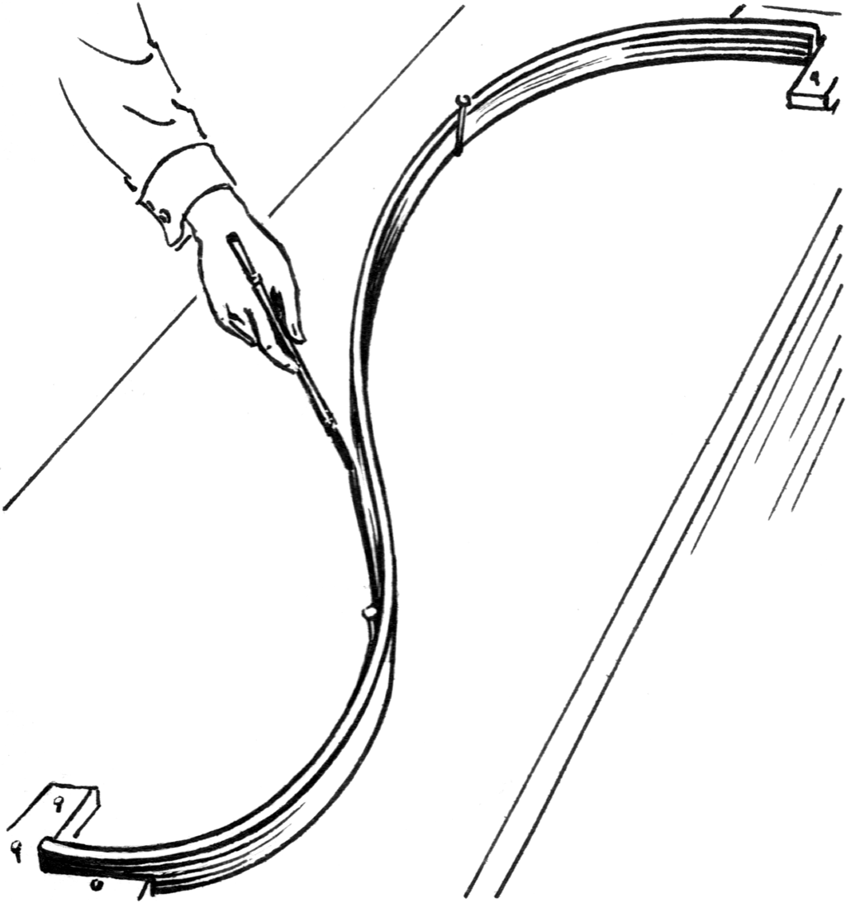

```{r setup, include=FALSE}
knitr::opts_chunk$set(echo = TRUE)
```
GAMMs are a flexible form of regression model well-matched to the complexities of the archaeological record, including non-normal distributions in the form of counts or proportions, non-independent observations with correlated errors, and non-linear functional relationships. Using two case studies -- an ethnographic marriage network and an archaeological assemblage similarity network -- I illustrate how this approach can lead to unbiased parameter estimates and more robust comparisons of competing hypotheses.

# Background

Distance is a fundamental constraint on human social interaction. This basic principle motivates the use of spatial interaction models for estimating flows of people, information, and resources on spatial and social networks. These models have both valid dynamical and statistical interpretations, a key strength well supported by theory and data from geography, economics, ecology, and genetics. To date, archaeologists have primarily relied on the dynamical approach because the idiosyncrasies of archaeological data make the wholesale adoption of statistical approaches from other fields impractical.

A basic spatial interaction model estimates the *flow* of goods, information, or people between spatially-structured populations as a function of the origin site, destination site, and the space between them:
$$flow = f\left(origin\right) \times f\left(destination\right) \times f\left(distance\right)$$


The difficult part comes when we have to define the $f\left(\right)$s. Economic geographers often use a generalized *linear* model (GLM), which requires them to definte the $f\left(\right)$s ahead of time. In a GAM, the $f\left(\right)$s are estimated directly from the data using splines.

Real-world splines are flexible strips of metal or wood used to draw curves. Mathematical splines are complex curves made of many smaller, simpler curves. *Penalized* regression splines can estimate $f\left(\right)$ from the data, limiting overfitting by penalizing the "wiggliness" of the function.




# Setup

Before starting analysis install and load the following packages. Where the package is not available on CRAN, use the commented code for installing directly from GitHub.

```{r, message = FALSE}
library(raster) # DEM for map
library(tidyverse) # data processing and plotting functions
library(sf) # tidy spatial data and mapping
library(mgcv) # fit GAMs and GAMMs
library(archdata) # source for the Oxford Pots data
library(tidygraph) # tidy network processing
# devtools::install_github('thomasp85/ggraph') # need dev version of ggraph 
library(ggraph) # network plots
# devtools::install_github('nspope/corMLPE')
library(corMLPE) # network correlation structure for undirected networks
# library(ggmap) # for geocoding, but not used by default (see below)
library(ggspatial) # scale bar for maps
library(maps) # country outlines for maps
```

# Case Studies

## Oxford Pots
First, we'll look at a dataset of Late Romano-British pottery available in the `archdata` package. \emph{\small{David L. Carlson and Georg Roth (2018). archdata: Example Datasets from Archaeological Research. R package version 1.2.}}
```{r}
data("OxfordPots")
```

### Preprocessing
Use `tidyr` and `dplyr` to get the data into a tidy format.
```{r}
pots <- OxfordPots %>%
  as_tibble %>%
  rename(to = Place) %>%
  gather(key, value, OxfordPct:NewForestDst) %>%
  separate(key, c('from', 'measure'), sep = -3) %>%
  spread(measure, value) %>%
  rename(percent = Pct, distance = Dst) %>%
  mutate(from = str_replace(from, 'NewForest', 'New Forest'),
         water = as.factor(WaterTrans == 1)) %>%
  select(to, from, percent, distance, water) %>%
  filter(!is.na(percent))
```

```{r, echo = FALSE}
pots
```

These data don't come with any location information, so we have to do some geocoding using the `ggmap` package. This requires you to get and register your own Google Maps API key, so by default this code chunk is not run and we instead use precomputed values. If you do want to run this chunk, follow the instructions in `?ggmap::register_google` and replace the line `<your-api-key-here>` with your API key.

```{r, eval = FALSE}
ggmap::register_google(key = "<your-api-key-here>")

pots_sites <- pots %>%
  select(from, to) %>% 
  gather %>%
  pull(value) %>%
  unique %>% 
  tibble(site = .) %>%
  # adjust some names 
  mutate(search_term = str_replace_all(site, c('Clausentum' = 'Bitterne', 
                                               'Mildenhall' = 'Mildenhall, Wiltshire')),
         search_term = paste0(search_term, ', UK')) %>%
  mutate_geocode(search_term) %>%
  select(-search_term) %>%
  st_as_sf(coords = c('lon', 'lat'), crs = 4326) %>%
  bind_cols(., as_tibble(st_coordinates(.))) %>%
  rename(x = X, y = Y)

saveRDS(pots_sites, 'oxfordpots_locations.RDS')
```

Join the Oxford Pots data to the geocoded locations.
```{r}
pots_sites <- readRDS('data/oxfordpots_locations.RDS') %>%
  left_join(dplyr::select(pots, to), by = c('site' = 'to'))
```

Make a network object using ``tidygraph` for plotting, and an edgelist tibble for modeling.
```{r}
pots_net <- tbl_graph(nodes = pots_sites, edges = pots, directed = TRUE) %E>%
  filter(!is.na(percent)) %>%
  mutate(similarity = percent / 100)

pots_dat <- pots_net %E>%
  mutate(x = .N()$x[to],
         y = .N()$y[to]) %>% 
  as_tibble %>%
  mutate(from = as.factor(from),
         to = as.factor(to))

pots_net
```

Visualize the result.
```{r, echo=FALSE}
# UK boundary shapefile for plotting.
uk_boundary <- maps::map('world', region = 'UK',
                    fill = TRUE, plot = FALSE) %>%
  st_as_sf

pots_net %E>%
  arrange(percent) %N>%
ggraph(., layout = 'manual', x = as_tibble(.)$x, y = as_tibble(.)$y) +
  geom_sf(data = uk_boundary, fill = NA) +
  geom_edge_link(aes(colour = percent), edge_width = 2, lineend = 'round') +
  geom_sf(data = filter(pots_sites, site %in% c('Oxford', 'New Forest')), size = 4) +
  scale_edge_color_viridis(guide = 'legend', name = 'Pottery \nfrom origin site',
                           labels = paste0(seq(5, 20, 5), '%'),
                           breaks = seq(5, 20, 5)) +
  annotation_scale(location = 'br', style = 'ticks') +
  coord_sf(datum = NA, xlim = c(-6, 2), ylim = c(50, 53.8)) +
  ggtitle('Ceramic distribution in Roman Britain', 
          'Percent late Romano-British pottery produced in Oxford and New Forest \n \n \n') +
  theme_void()
```

### Analysis

We're interested in whether the spatial constraints on pottery distribution are different for land or water transport. Fit a GAM in order to estimate the empirical distance decay function from the data, and allow different functions for land versus water transport. We'll use a so-called "origin-constrained" spatial interaction model, which means we add a origin-site specific intercepts to account for network autocorrelation. Because the data are percents, we'll model the errors as beta distributed, so that we don't get any predictions above 100% or below 0%.

In the GAM formula below, `s()` allows us to fit an arbitrary spline of distance, `by = water` allows us to fit different splines for water and land transport. The `from` term fits a different intercept  for each of the two origin sites, controlling for differential export of ceramics from the source cites.

```{r}
pots_model <- gam(similarity ~ s(distance, by = water) + water + from,
                family = betar(), # beta distribution between 0 and 1
                method = 'REML', # algorithm to estimate the GAM
                select = TRUE, # allow variables to be selected out
                data = pots_dat)
```

Check the model using `summary`. The model has an adjusted R2 of 0.705. Examining the significance of the smooth terms reveals that the spline of distance for land transport is significant, but the spline for water transport is not (which means the spline for water transport is selected out of the model, leaving only the intercept).
```{r}
summary(pots_model)
```

Let's visualize the resulting spline functions fit by the GAM. It appears that overland travel is subject to logarithmic distance decay, but water transport seems to have no such constraints. This is a case where we've used penalization as form of model selection. The data showed no signal of a distance effect for water transport, so the penalized spline was reduced to a flat line.
```{r, echo = FALSE}
tmp1 <- expand.grid(distance = 0:140, water = c(TRUE, FALSE), from = 2)
predict(pots_model, tmp1, type = 'response', se.fit = TRUE) %>%
  bind_cols(tmp1) %>%
  mutate(fit = fit * 100,
         lower = fit - 2 * se.fit * 100,
         upper = fit + 2 * se.fit * 100) %>%
  ggplot(aes(distance, fit, group = water)) +
  geom_ribbon(aes(ymin = lower, ymax = upper, fill = water), alpha = .2) +
  geom_line(aes(y = fit, color = water), size = 1.2) +
  scale_color_manual(values = c('#22A884', '#414487'), name = 'Transport', labels = c('Land', 'Water')) +
  scale_fill_manual(values = c('#22A884', '#414487'), name = 'Transport', labels = c('Land', 'Water')) +
  theme_classic() +
  labs(x = 'Distance (km)', y = 'Pottery from origin site (%)',
       title = 'Distance decay functions on land and water') 
```

Finally, examining the residuals reveals interactions that are unusually stronger of weaker than we'd expect by distance alone.
```{r, echo = FALSE}
pots_net %E>%
  mutate(res = residuals(pots_model, type = 'response') * 100) %>%
  arrange(abs(res)) %N>%
ggraph(., layout = 'manual', x = as_tibble(.)$x, y = as_tibble(.)$y) +
  geom_sf(data = uk_boundary, fill = NA) +
  geom_edge_link(aes(colour = res), edge_width = 2, lineend = 'round') +
  geom_sf(data = filter(pots_sites, site %in% c('Oxford', 'New Forest')), size = 4) +
  scale_edge_color_distiller(palette = 'RdBu', limits = c(-8, 8), labels = paste0(seq(-8, 8, by = 4), '%'), guide = 'legend', name = 'Residuals') +
  coord_sf(datum = NA, xlim = c(-6, 2), ylim = c(50, 53.8)) +
  labs(title = 'Residuals from an origin-constrained spatial interaction model',
    caption = 'Red ties stronger then expected, blue ties weaker') +
  theme_void()
```

## Chumash Marriages

### Preprocessing

Next we'll explore a dataset of intervillage marriages among the Chumash of coastal southern California. Marriage counts, along with the number of baptisms from each village (a population proxy), were recorded by local Spanish missionaries. These data have been digitized from John Johnson's PhD thesis. \emph{\small{John R. Johnson, “Chumash social organization: An ethnohistorical perspective”. PhD thesis. UC Santa Barbara, 1988.}}

Start by importing the village locations and creating an `sf` object. In addition to village names, baptisms, and locations, we have information as to whether the village was situated on the coast or not. Later, we'll use these data to test whether ties between different ecological zones (coastal and inland) are stronger than would expected by distance.

```{r}
chumash_villages <- read_csv('data/chumash_villages.csv') %>%
  st_as_sf(coords = c('x', 'y'), crs = 4326) %>%
  bind_cols(., as_tibble(st_coordinates(.))) %>%
  rename(x = X, y = Y) %>%
  mutate(size = ordered(size, levels = c('hamlet', 'small', 'medium', 'large', 'very large', 'largest'))) 
```
```{r, echo = FALSE}
chumash_villages
```

Next import the marriage data, join to the village data, and calculate the pairwise euclidean distances between all sites. Also create an edgelist from this network, which we'll use for the actual modeling.
```{r}
chumash_net <- read.csv('data/chumash_marriages.csv', row.names = 1) %>%
  as.matrix %>% 
  replace(. == 0, 999) %>% # replace 0 values with 999 temporarily
  as_tbl_graph(directed = FALSE) %E>%
  filter(!edge_is_loop()) %>%
  rename(marriages = weight) %>%
  mutate(marriages = if_else(marriages == 999, 0, marriages))%N>%
  mutate(centrality = centrality_degree(weights = marriages)) %>%
  left_join(chumash_villages, by = c('name' = 'village')) %E>%
  mutate(distance = st_distance(.N()$geometry[from], .N()$geometry[to], by_element = TRUE),
         distance = as.numeric(distance) / 1000,
         baptisms = .N()$baptisms[from] * .N()$baptisms[to],
         eco_same = as.factor(.N()$coastal[from] == .N()$coastal[to]))

chumash_dat <-  chumash_net %E>% as_tibble
```

```{r, echo = FALSE}
chumash_net
```

Map the resulting data, along with a DEM and estimated least cost paths to aid the visualization.
```{r, echo = FALSE}
elev <- raster('data/santa_barbara_dem.tif') %>% 
  as.data.frame(xy = TRUE, na.rm = TRUE)

chumash_paths <- read_sf('data/chumash_paths.shp')

chumash_paths %>%  
  arrange(marriages) %>%
  ggplot +
  geom_raster(data = elev, aes(x, y, fill = santa_barbara_dem), show.legend = FALSE) +
  geom_sf(aes(color = marriages), size = 2) +
  geom_sf(data = chumash_villages, aes(size = baptisms), show.legend = 'point') +
  scale_size_area(name = 'Baptisms') +
  scale_color_viridis_c(name = '    Marriages\n ') +
  annotation_scale(style = 'ticks', pad_x = unit(4.35, 'cm'), pad_y = unit(.5, 'cm')) +
  scale_fill_viridis_c(option = 'D', alpha = .6) +
  theme_void() +
  coord_sf(datum = NA) +
  ggtitle('Coastal Chumash marriages in southern California', 
          'Marriages in mission registers, population estimated from baptisms') +
  theme(legend.position = 'bottom')
```

### Analysis

Our marriage data are a bit more complicated to model than the Roman pottery above. The data are in the form of counts with lots of 0 values, so we'll use a quasipoisson error distribution. 

Also, we only know the count of marriages between each village pair, and have no record of the *direction* of the flow. This means that we can't distinguish between origin and destination effects in our spatial interaction model, and are instead limited to "site-level effects", which can be any symmetric function of each site pair. Here we'll simply use the product of the baptisms at each pair of sites. The network autocorrelation introduced here will thus be a bit more complicated, requiring something more than the origin-specific fixed effects used above. We can use the `corMLPE` function, a specialized correlation structure for modeling pairwise symmetric data. 

Because of the correlation structure, we'll use the `GAMM` function for mixed models, rather than the `GAM` function used above. It uses a different algorithm under the hood, and results in both a `GAM` and `lme` object. The `te()` function used above refers to a tensor spline, a continuous two dimensional spline for modeling interactions between two continuous variables, in this case size and distance. 

```{r, message = FALSE}
marriage_model <- gamm(marriages ~ te(distance, baptisms) + eco_same,
           family =  quasipoisson(), # overdispersed count data
           correlation = corMLPE(form = ~from + to), # symmetric network correlation structure
           method = 'REML',
           select = TRUE,
           data = chumash_dat)
```

Examine the results, both of the `GAM` and `lme` components of the model. The model has an adjusted R2 of 0.465. The `eco_same` term we included is positive and significant, meaning there are slightly more marriages between regions in the same ecological zone (coastal or inland) than across zones. On the `lme` side, we can see `rho` parameter is 0.052, meaning that the network autocorrelation introduced by two edges sharing the same node is about 5.2% out of a possible 50%.

```{r}
summary(marriage_model$gam)
summary(marriage_model$lme)
```

We can visualize the result in two or three dimensions.
```{r, echo = FALSE}
expand.grid(baptisms = seq(0, 300)^2,
            distance = seq(0, 30, 0.1),
            eco_same = FALSE) %>%
  mutate(marriages = predict(marriage_model$gam, ., type = 'response')) %>%
  ggplot(aes(distance, sqrt(baptisms), fill = marriages)) +
  geom_raster() +
  scale_fill_viridis_c(guide = 'legend', breaks = c(0,2,4,6,8,10,12), name = 'Marriages') +
  labs(title = 'Tensor spline of population and distance', x = 'Distance (km)', y = 'Baptisms') +
  theme_classic() +
  coord_fixed(ratio = .1)
```

```{r, echo = FALSE}
vis.gam(marriage_model$gam, view = c('distance', 'baptisms'), theta = 45, phi = 15, type = 'response', se = -1, color = 'bw')
```

