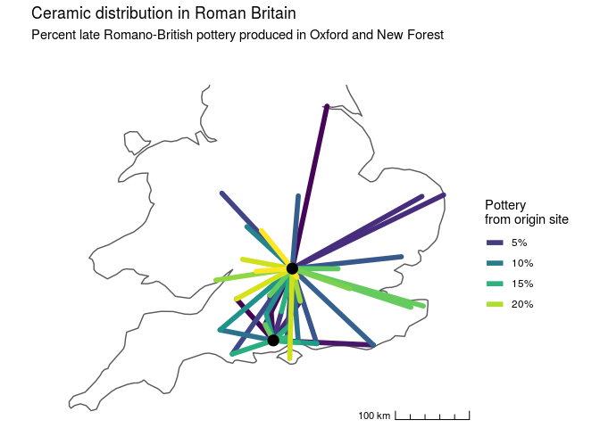
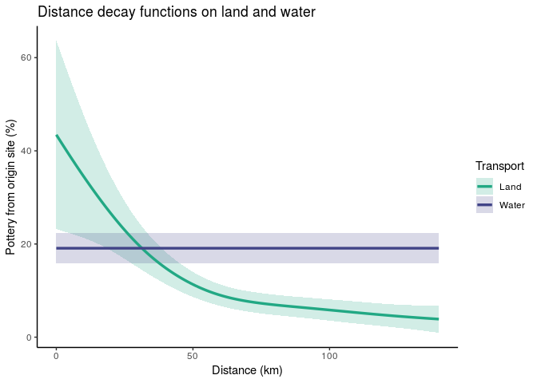
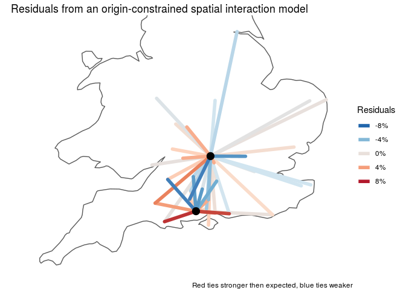
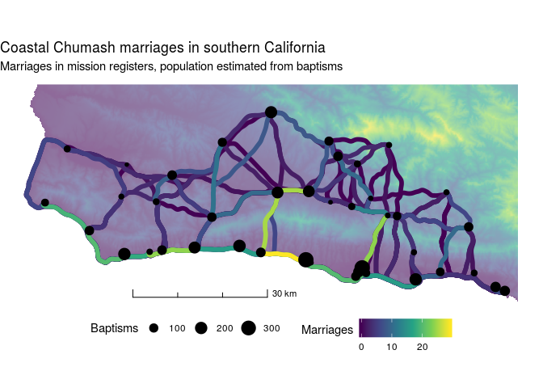
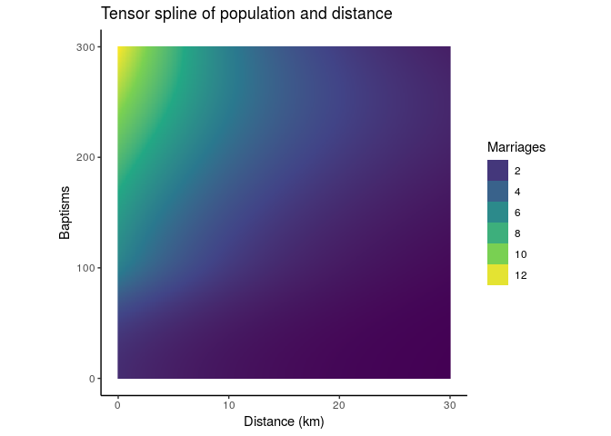
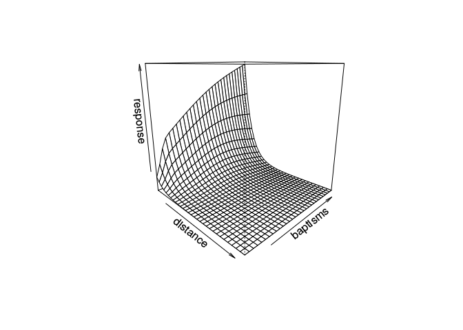

Generalized additive mixed models for spatial networks
================
Nick Gauthier

-   [Background](#background)
-   [Setup](#setup)
-   [Case Studies](#case-studies)
    -   [Oxford Pots](#oxford-pots)
        -   [Preprocessing](#preprocessing)
        -   [Analysis](#analysis)
    -   [Chumash Marriages](#chumash-marriages)
        -   [Preprocessing](#preprocessing-1)
        -   [Analysis](#analysis-1)

GAMMs are a flexible form of regression model well-matched to the complexities of the archaeological record, including non-normal distributions in the form of counts or proportions, non-independent observations with correlated errors, and non-linear functional relationships. Using two case studies -- an ethnographic marriage network and an archaeological assemblage similarity network -- I illustrate how this approach can lead to unbiased parameter estimates and more robust comparisons of competing hypotheses.

Background
==========

Distance is a fundamental constraint on human social interaction. This basic principle motivates the use of spatial interaction models for estimating flows of people, information, and resources on spatial and social networks. These models have both valid dynamical and statistical interpretations, a key strength well supported by theory and data from geography, economics, ecology, and genetics. To date, archaeologists have primarily relied on the dynamical approach because the idiosyncrasies of archaeological data make the wholesale adoption of statistical approaches from other fields impractical.

A basic spatial interaction model estimates the *flow* of goods, information, or people between spatially-structured populations as a function of the origin site, destination site, and the space between them:
*f**l**o**w* = *f*(*o**r**i**g**i**n*) × *f*(*d**e**s**t**i**n**a**t**i**o**n*) × *f*(*d**i**s**t**a**n**c**e*)
 

The difficult part comes when we have to define the *f*()s. Economic geographers often use a generalized *linear* model (GLM), which requires them to definte the *f*()s ahead of time. In a GAM, the *f*()s are estimated directly from the data using splines.

Real-world splines are flexible strips of metal or wood used to draw curves. Mathematical splines are complex curves made of many smaller, simpler curves. *Penalized* regression splines can estimate *f*() from the data, limiting overfitting by penalizing the "wiggliness" of the function.


Setup
=====

Before starting analysis install and load the following packages. Where the package is not available on CRAN, use the commented code for installing directly from GitHub.

``` r
library(raster) # DEM for map
library(tidyverse) # data processing and plotting functions
library(sf) # tidy spatial data and mapping
library(mgcv) # fit GAMs and GAMMs
library(archdata) # source for the Oxford Pots data
library(tidygraph) # tidy network processing
# devtools::install_github('thomasp85/ggraph') # need dev version of ggraph 
library(ggraph) # network plots
# devtools::install_github('nspope/corMLPE')
library(corMLPE) # network correlation structure for undirected networks
# library(ggmap) # for geocoding, but not used by default (see below)
library(ggspatial) # scale bar for maps
library(maps) # country outlines for maps
```

Case Studies
============

Oxford Pots
-----------

First, we'll look at a dataset of Late Romano-British pottery available in the `archdata` package.

``` r
data("OxfordPots")
```

### Preprocessing

Use `tidyr` and `dplyr` to get the data into a tidy format.

``` r
pots <- OxfordPots %>%
  as_tibble %>%
  rename(to = Place) %>%
  gather(key, value, OxfordPct:NewForestDst) %>%
  separate(key, c('from', 'measure'), sep = -3) %>%
  spread(measure, value) %>%
  rename(percent = Pct, distance = Dst) %>%
  mutate(from = str_replace(from, 'NewForest', 'New Forest'),
         water = as.factor(WaterTrans == 1)) %>%
  select(to, from, percent, distance, water) %>%
  filter(!is.na(percent))
```

    ## # A tibble: 43 x 5
    ##    to               from       percent distance water
    ##    <chr>            <chr>        <dbl>    <dbl> <fct>
    ##  1 Alchester        Oxford       22.5        11 TRUE 
    ##  2 Bath             New Forest    1.25       45 TRUE 
    ##  3 Bath             Oxford       21.2        55 TRUE 
    ##  4 Brough-on-Humber Oxford        1.5       140 FALSE
    ##  5 Caerwent         Oxford       19          74 TRUE 
    ##  6 Caister          Oxford        4         135 FALSE
    ##  7 Canterbury       Oxford       17.5       105 TRUE 
    ##  8 Chichester       New Forest   13          40 FALSE
    ##  9 Chichester       Oxford        6.75       65 FALSE
    ## 10 Cholchester      Oxford        7          95 FALSE
    ## # … with 33 more rows

These data don't come with any location information, so we have to do some geocoding using the `ggmap` package. This requires you to get and register your own Google Maps API key, so by default this code chunk is not run and we instead use precomputed values. If you do want to run this chunk, follow the instructions in `?ggmap::register_google` and replace the line `<your-api-key-here>` with your API key.

``` r
ggmap::register_google(key = "<your-api-key-here>")

pots_sites <- pots %>%
  select(from, to) %>% 
  gather %>%
  pull(value) %>%
  unique %>% 
  tibble(site = .) %>%
  # adjust some names 
  mutate(search_term = str_replace_all(site, c('Clausentum' = 'Bitterne', 
                                               'Mildenhall' = 'Mildenhall, Wiltshire')),
         search_term = paste0(search_term, ', UK')) %>%
  mutate_geocode(search_term) %>%
  select(-search_term) %>%
  st_as_sf(coords = c('lon', 'lat'), crs = 4326) %>%
  bind_cols(., as_tibble(st_coordinates(.))) %>%
  rename(x = X, y = Y)

saveRDS(pots_sites, 'oxfordpots_locations.RDS')
```

Join the Oxford Pots data to the geocoded locations.

``` r
pots_sites <- readRDS('data/oxfordpots_locations.RDS') %>%
  left_join(dplyr::select(pots, to), by = c('site' = 'to'))
```

Make a network object using \``tidygraph` for plotting, and an edgelist tibble for modeling.

``` r
pots_net <- tbl_graph(nodes = pots_sites, edges = pots, directed = TRUE) %E>%
  filter(!is.na(percent)) %>%
  mutate(similarity = percent / 100)

pots_dat <- pots_net %E>%
  mutate(x = .N()$x[to],
         y = .N()$y[to]) %>% 
  as_tibble %>%
  mutate(from = as.factor(from),
         to = as.factor(to))

pots_net
```

    ## # A tbl_graph: 45 nodes and 43 edges
    ## #
    ## # A directed acyclic simple graph with 14 components
    ## #
    ## # Edge Data: 43 x 6 (active)
    ##    from    to percent distance water similarity
    ##   <int> <int>   <dbl>    <dbl> <fct>      <dbl>
    ## 1     2     3   22.5        11 TRUE      0.225 
    ## 2     1     4    1.25       45 TRUE      0.0125
    ## 3     2     4   21.2        55 TRUE      0.212 
    ## 4     2     6    1.5       140 FALSE     0.015 
    ## 5     2     7   19          74 TRUE      0.19  
    ## 6     2     8    4         135 FALSE     0.04  
    ## # … with 37 more rows
    ## #
    ## # Node Data: 45 x 4
    ##   site           x     y             geometry
    ##   <chr>      <dbl> <dbl>          <POINT [°]>
    ## 1 New Forest -1.63  50.9 (-1.631463 50.87652)
    ## 2 Oxford     -1.26  51.8 (-1.257726 51.75202)
    ## 3 Alchester  -1.87  52.2 (-1.867605 52.21531)
    ## # … with 42 more rows

Visualize the result. 

### Analysis

We're interested in whether the spatial constraints on pottery distribution are different for land or water transport. Fit a GAM in order to estimate the empirical distance decay function from the data, and allow different functions for land versus water transport. We'll use a so-called "origin-constrained" spatial interaction model, which means we add a origin-site specific intercepts to account for network autocorrelation. Because the data are percents, we'll model the errors as beta distributed, so that we don't get any predictions above 100% or below 0%.

In the GAM formula below, `s()` allows us to fit an arbitrary spline of distance, `by = water` allows us to fit different splines for water and land transport. The `from` term fits a different intercept for each of the two origin sites, controlling for differential export of ceramics from the source cites.

``` r
pots_model <- gam(similarity ~ s(distance, by = water) + water + from,
                family = betar(), # beta distribution between 0 and 1
                method = 'REML', # algorithm to estimate the GAM
                select = TRUE, # allow variables to be selected out
                data = pots_dat)
```

Check the model using `summary`. The model has an adjusted R2 of 0.705. Examining the significance of the smooth terms reveals that the spline of distance for land transport is significant, but the spline for water transport is not (which means the spline for water transport is selected out of the model, leaving only the intercept).

``` r
summary(pots_model)
```

    ## 
    ## Family: Beta regression(47.352) 
    ## Link function: logit 
    ## 
    ## Formula:
    ## similarity ~ s(distance, by = water) + water + from
    ## 
    ## Parametric coefficients:
    ##             Estimate Std. Error z value Pr(>|z|)    
    ## (Intercept)  -2.9803     0.1661 -17.943  < 2e-16 ***
    ## waterTRUE     0.5409     0.1437   3.765 0.000167 ***
    ## from2         0.9953     0.1988   5.006 5.54e-07 ***
    ## ---
    ## Signif. codes:  0 '***' 0.001 '**' 0.01 '*' 0.05 '.' 0.1 ' ' 1
    ## 
    ## Approximate significance of smooth terms:
    ##                              edf Ref.df Chi.sq  p-value    
    ## s(distance):waterFALSE 2.427e+00      9  44.21 2.06e-11 ***
    ## s(distance):waterTRUE  9.886e-05      9   0.00    0.717    
    ## ---
    ## Signif. codes:  0 '***' 0.001 '**' 0.01 '*' 0.05 '.' 0.1 ' ' 1
    ## 
    ## R-sq.(adj) =  0.705   Deviance explained =   69%
    ## -REML = -70.463  Scale est. = 1         n = 43

Let's visualize the resulting spline functions fit by the GAM. It appears that overland travel is subject to logarithmic distance decay, but water transport seems to have no such constraints. This is a case where we've used penalization as form of model selection. The data showed no signal of a distance effect for water transport, so the penalized spline was reduced to a flat line. 

Finally, examining the residuals reveals interactions that are unusually stronger of weaker than we'd expect by distance alone. 

Chumash Marriages
-----------------

### Preprocessing

Next we'll explore a dataset of intervillage marriages among the Chumash of coastal southern California. Marriage counts, along with the number of baptisms from each village (a population proxy), were recorded by local Spanish missionaries. These data have been digitized from John Johnson's PhD thesis.

Start by importing the village locations and creating an `sf` object. In addition to village names, baptisms, and locations, we have information as to whether the village was situated on the coast or not. Later, we'll use these data to test whether ties between different ecological zones (coastal and inland) are stronger than would expected by distance.

``` r
chumash_villages <- read_csv('data/chumash_villages.csv') %>%
  st_as_sf(coords = c('x', 'y'), crs = 4326) %>%
  bind_cols(., as_tibble(st_coordinates(.))) %>%
  rename(x = X, y = Y) %>%
  mutate(size = ordered(size, levels = c('hamlet', 'small', 'medium', 'large', 'very large', 'largest'))) 
```

    ## Parsed with column specification:
    ## cols(
    ##   village = col_character(),
    ##   baptisms = col_double(),
    ##   size = col_character(),
    ##   coastal = col_logical(),
    ##   x = col_double(),
    ##   y = col_double()
    ## )

    ## Simple feature collection with 41 features and 6 fields
    ## geometry type:  POINT
    ## dimension:      XY
    ## bbox:           xmin: -120.6025 ymin: 34.38628 xmax: -119.4828 ymax: 34.74438
    ## epsg (SRID):    4326
    ## proj4string:    +proj=longlat +datum=WGS84 +no_defs
    ## # A tibble: 41 x 7
    ##    village   baptisms size       coastal     x     y             geometry
    ##    <chr>        <dbl> <ord>      <lgl>   <dbl> <dbl>          <POINT [°]>
    ##  1 Alcas           78 medium     TRUE    -120.  34.4 (-119.8207 34.42212)
    ##  2 Aquitsumu       98 large      FALSE   -120.  34.7 (-119.9111 34.68646)
    ##  3 Calahuasa      182 very large FALSE   -120.  34.6 (-120.0362 34.58337)
    ##  4 Casil          115 large      TRUE    -120.  34.5  (-120.077 34.46335)
    ##  5 Coloc           48 medium     TRUE    -120.  34.4 (-119.5574 34.42212)
    ##  6 Cuyamu          27 small      TRUE    -120.  34.4 (-119.9547 34.44273)
    ##  7 Elijman         17 small      FALSE   -120.  34.6 (-119.9074 34.56398)
    ##  8 Estait         111 large      TRUE    -120.  34.5 (-120.3175 34.46801)
    ##  9 Geliec         102 large      TRUE    -120.  34.4 (-119.8458 34.41549)
    ## 10 Gelo           152 large      TRUE    -120.  34.4 (-119.8389 34.42433)
    ## # … with 31 more rows

Next import the marriage data, join to the village data, and calculate the pairwise euclidean distances between all sites. Also create an edgelist from this network, which we'll use for the actual modeling.

``` r
chumash_net <- read.csv('data/chumash_marriages.csv', row.names = 1) %>%
  as.matrix %>% 
  replace(. == 0, 999) %>% # replace 0 values with 999 temporarily
  as_tbl_graph(directed = FALSE) %E>%
  filter(!edge_is_loop()) %>%
  rename(marriages = weight) %>%
  mutate(marriages = if_else(marriages == 999, 0, marriages))%N>%
  mutate(centrality = centrality_degree(weights = marriages)) %>%
  left_join(chumash_villages, by = c('name' = 'village')) %E>%
  mutate(distance = st_distance(.N()$geometry[from], .N()$geometry[to], by_element = TRUE),
         distance = as.numeric(distance) / 1000,
         baptisms = .N()$baptisms[from] * .N()$baptisms[to],
         eco_same = as.factor(.N()$coastal[from] == .N()$coastal[to]))

chumash_dat <-  chumash_net %E>% as_tibble
```

    ## # A tbl_graph: 41 nodes and 820 edges
    ## #
    ## # An undirected simple graph with 1 component
    ## #
    ## # Edge Data: 820 x 6 (active)
    ##    from    to marriages distance baptisms eco_same
    ##   <int> <int>     <dbl>    <dbl>    <dbl> <fct>   
    ## 1     1     2         4     11.7     7208 TRUE    
    ## 2     1     3         8     21.1    13600 TRUE    
    ## 3     1     4         1     25.8     2788 TRUE    
    ## 4     1     5         2     28.2     7548 TRUE    
    ## 5     1     6         1     34.9    12648 TRUE    
    ## 6     1     7         0     44.5    14008 TRUE    
    ## # … with 814 more rows
    ## #
    ## # Node Data: 41 x 8
    ##   name  centrality baptisms size  coastal     x     y
    ##   <chr>      <dbl>    <dbl> <ord> <lgl>   <dbl> <dbl>
    ## 1 Nocto         21       68 medi… TRUE    -121.  34.6
    ## 2 Sili…         30      106 large TRUE    -120.  34.5
    ## 3 Siso…         47      200 very… TRUE    -120.  34.5
    ## # … with 38 more rows, and 1 more variable: geometry <POINT [°]>

Map the resulting data, along with a DEM and estimated least cost paths to aid the visualization. 

### Analysis

Our marriage data are a bit more complicated to model than the Roman pottery above. The data are in the form of counts with lots of 0 values, so we'll use a quasipoisson error distribution.

Also, we only know the count of marriages between each village pair, and have no record of the *direction* of the flow. This means that we can't distinguish between origin and destination effects in our spatial interaction model, and are instead limited to "site-level effects", which can be any symmetric function of each site pair. Here we'll simply use the product of the baptisms at each pair of sites. The network autocorrelation introduced here will thus be a bit more complicated, requiring something more than the origin-specific fixed effects used above. We can use the `corMLPE` function, a specialized correlation structure for modeling pairwise symmetric data.

Because of the correlation structure, we'll use the `GAMM` function for mixed models, rather than the `GAM` function used above. It uses a different algorithm under the hood, and results in both a `GAM` and `lme` object. The `te()` function used above refers to a tensor spline, a continuous two dimensional spline for modeling interactions between two continuous variables, in this case size and distance.

``` r
marriage_model <- gamm(marriages ~ te(distance, baptisms) + eco_same,
           family =  quasipoisson(), # overdispersed count data
           correlation = corMLPE(form = ~from + to), # symmetric network correlation structure
           method = 'REML',
           select = TRUE,
           data = chumash_dat)
```

    ## 
    ##  Maximum number of PQL iterations:  20

Examine the results, both of the `GAM` and `lme` components of the model. The model has an adjusted R2 of 0.465. The `eco_same` term we included is positive and significant, meaning there are slightly more marriages between regions in the same ecological zone (coastal or inland) than across zones. On the `lme` side, we can see `rho` parameter is 0.052, meaning that the network autocorrelation introduced by two edges sharing the same node is about 5.2% out of a possible 50%.

``` r
summary(marriage_model$gam)
```

    ## 
    ## Family: quasipoisson 
    ## Link function: log 
    ## 
    ## Formula:
    ## marriages ~ te(distance, baptisms) + eco_same
    ## 
    ## Parametric coefficients:
    ##              Estimate Std. Error t value Pr(>|t|)    
    ## (Intercept)  -1.97783    0.19982  -9.898  < 2e-16 ***
    ## eco_sameTRUE  0.27273    0.09318   2.927  0.00352 ** 
    ## ---
    ## Signif. codes:  0 '***' 0.001 '**' 0.01 '*' 0.05 '.' 0.1 ' ' 1
    ## 
    ## Approximate significance of smooth terms:
    ##                         edf Ref.df     F p-value    
    ## te(distance,baptisms) 5.978  5.978 58.72  <2e-16 ***
    ## ---
    ## Signif. codes:  0 '***' 0.001 '**' 0.01 '*' 0.05 '.' 0.1 ' ' 1
    ## 
    ## R-sq.(adj) =  0.465   
    ##   Scale est. = 0.94783   n = 820

``` r
summary(marriage_model$lme)
```

    ## Linear mixed-effects model fit by maximum likelihood
    ##  Data: data 
    ##        AIC     BIC    logLik
    ##   3785.867 3828.25 -1883.933
    ## 
    ## Random effects:
    ##  Formula: ~Xr - 1 | g
    ##  Structure: pdTens
    ##              Xr1      Xr2      Xr3      Xr4      Xr5      Xr6      Xr7
    ## StdDev: 344.9619 350.8808 351.6174 351.6234 190.1839 292.3562 31.79868
    ##              Xr8      Xr9     Xr10    Xr11    Xr12    Xr13     Xr14
    ## StdDev: 14.07513 89.27395 118.0023 118.924 118.995 118.492 30.02855
    ##             Xr15     Xr16     Xr17     Xr18     Xr19      Xr20      Xr21
    ## StdDev: 3.484267 12.13613 31.12296 31.18348 27.11782 0.3748196 0.7289078
    ##          Residual
    ## StdDev: 0.9735678
    ## 
    ## Correlation Structure: corMLPE
    ##  Formula: ~from + to | g 
    ##  Parameter estimate(s):
    ##        rho 
    ## 0.05234851 
    ## Variance function:
    ##  Structure: fixed weights
    ##  Formula: ~invwt 
    ## Fixed effects: list(fixed) 
    ##                                Value Std.Error  DF    t-value p-value
    ## X(Intercept)               -1.977828  0.200189 815  -9.879795  0.0000
    ## Xeco_sameTRUE               0.272731  0.093348 815   2.921648  0.0036
    ## Xte(distance,baptisms)Fx1 -13.976951  1.252555 815 -11.158756  0.0000
    ## Xte(distance,baptisms)Fx2  -0.226844  4.466917 815  -0.050783  0.9595
    ## Xte(distance,baptisms)Fx3  -9.941226  2.277433 815  -4.365102  0.0000
    ##  Correlation: 
    ##                           X(Int) X_TRUE X(,)F1 X(,)F2
    ## Xeco_sameTRUE             -0.180                     
    ## Xte(distance,baptisms)Fx1  0.828  0.169              
    ## Xte(distance,baptisms)Fx2  0.028 -0.046  0.202       
    ## Xte(distance,baptisms)Fx3  0.272  0.031  0.431  0.913
    ## 
    ## Standardized Within-Group Residuals:
    ##         Min          Q1         Med          Q3         Max 
    ## -2.01916555 -0.61331347 -0.28763158 -0.07711829  7.46458782 
    ## 
    ## Number of Observations: 820
    ## Number of Groups: 1

We can visualize the result in two or three dimensions. 


