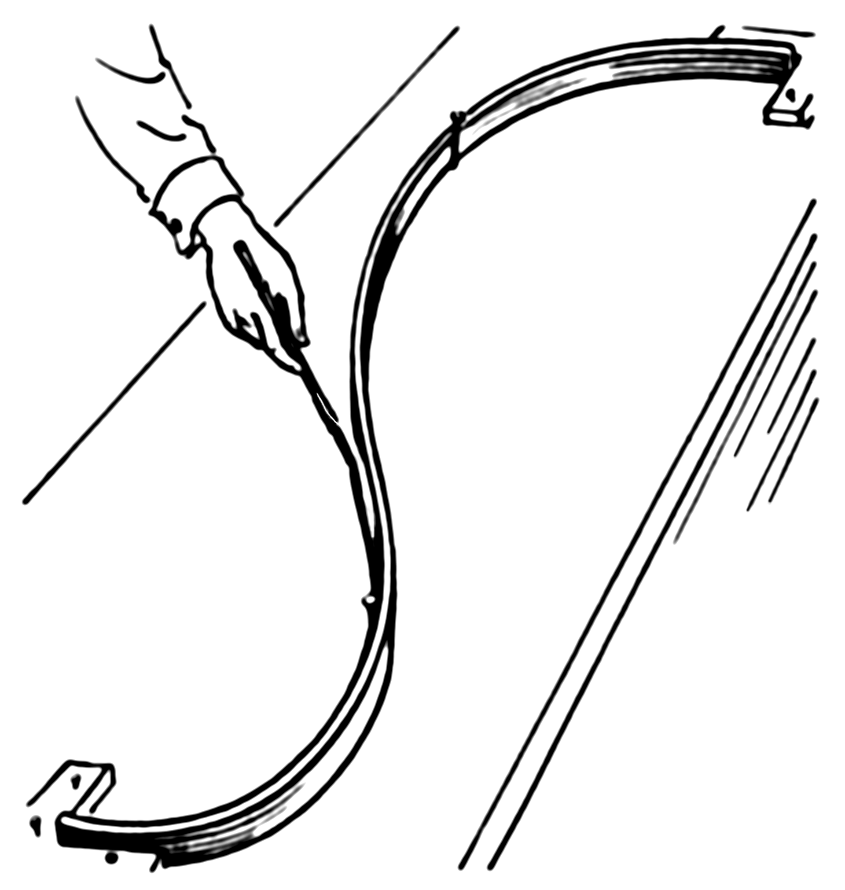

---
#---POSTER SIZE & DEFAULT FONT---#
poster_height: "36in" # height in inches of poster
poster_width: "48in" # width in inches of poster
font_family: "palatino" # choose from typical latex fonts (example: "palatino")
font_size: "30pt" #please see github.com/brentthorne/posterdown for compatible options.

#---TITLE BOX OPTIONS---#
#ESSENTIALS
title: '\fontfamily{phv}\selectfont Generalized additive mixed models for archaeological network data'
author: "Nicolas Gauthier"
affiliation: "School of Human Evolution and Social Change, Arizona State University"
#STYLE & FORMATTING
titlebox_bgcol: "253494"  #Colour of the Title Box background
titlebox_bordercol: "41b6c4" #Colour of the title Box border.
titlebox_shape: "all"
titlebox_borderwidth: "1cm"
title_textcol: "ffffff" #colour of title text
author_textcol: "ffffff" # Colour of author text
affiliation_textcol: "ffffff" # Colour of affiliation text
title_textsize: "Huge"         # Poster title fontsize
author_textsize: "Large"       # Author list font size
affiliation_textsize: "large"  # Affiliation font size
#ADDING LOGOS
logoleft_name: 'Figures/shesc'
logoleft_width: '5in'
logoleft_xshift: '1in'
logoleft_yshift: '1in'
logoright_name: 'Figures/quantarch3'
logoright_width: '5in'
logoright_xshift: '-1in'
logoright_yshift: '1in'

#---POSTER BODY OPTIONS---#
body_bgcol: "ffffff" #colour of the poster main background
body_textsize: "normalsize"    # Size of the main poster body text
body_textcol: "594F4F"#000000" # Colour of main text in the body of poster
column_numbers: 3 # Number of columns that the poster has
column_margins: "0.5in" # Margin spacing for columns
columnline_col: "008080" #colour 
columnline_width: "0pt" #width of line between each column
#SECTION TITLE STYLING
sectitle_textcol: "ffffff" # Colour of the poster section titles
sectitle_bgcol: "253494" # Colour of the section title box
sectitle_bordercol: "41b6c4" # Colour of the border around the section title box.
sectitle_borderwidth: "2mm" # Thicknes of the section title box border
sectitle_boxshape: "uphill" # Changes the shape of the section title box.

#---BIBLIOGRAPHY OPTIONS---#
bibliography: MyLibrary # name of the .bib file used for referencing
bibliography_spacing: 0.8 # sets the multiplier for line spacing of bibliography spacing (between 0 and 1)
bibliography_textsize: "small"  # size of the bibliography text size (handy for one too many references!)

#---OTHER---#
cite_col: "CC0000" #colour of ciation elements
url_col: "008080" #colour of url links
link_col: "008080" #colour of other links within the poster
footnote_textcol: "ffffff" # Colour of footnote text if used
output: posterdown::posterdown_latex
---

```{r, include=FALSE}
knitr::opts_chunk$set(echo = FALSE, results = 'asis', out.width = "100%", warning = FALSE, fig.align = 'center', message = FALSE, dev='cairo_pdf')
```

```{r}
#devtools::install_github('brentthorne/posterdown')
#library(posterdown)
library(maps)
library(tidyverse)
library(readxl)
library(mgcv)
library(ggmap)
library(sf)
# devtools::install_github('nspope/corMLPE')
library(corMLPE)
library(tidygraph)
library(ggraph)
library(archdata)
```

# What's a GAMM?

GAMMs are a flexible form of regression model well-matched to the complexities of the archaeological record, including non-normal distributions such as counts or proportions, non-linear functional relationships, and non-independent observations with correlated errors.

\vspace{1cm}

**Let's break it down:**

* *Generalized* -- Model data different distributions
* *Additive* -- Additive function of smooth functions. 
* *Mixed* -- Random effects to model network autocorrelation

# How do they work?

Penalized plines are the secret sauce that make GAMs so useful. They allow us estimate functional forms directly from the data, while attempting to minimize overfitting by penalized the ``wiggliness'' of the function.

\

# What can I do with them?

Alot! Let's look at two examples.

## Oxford Pots

A dataset of Late Romano-British pottery. 
```{r}
data("OxfordPots")
pots <- OxfordPots %>%
  rename(to = Place) %>%
  gather(key, value, OxfordPct:NewForestDst) %>%
  separate(key, c('from', 'measure'), sep = -3) %>%
  spread(measure, value) %>%
  rename(percent = Pct, distance = Dst) %>%
  mutate(from = str_replace(from, 'NewForest', 'New Forest'))
```

```{r}
pots_sites <- readRDS('data/oxfordpots_locations.RDS') %>%
  left_join(select(pots, to, WalledArea) %>% group_by(to) %>% 
              summarise(area = mean(WalledArea)), by = c('site' = 'to'))

pots_net <- tbl_graph(nodes = pots_sites, edges = pots, directed = TRUE) %E>%
  filter(!is.na(percent)) %>%
  mutate(similarity = percent / 100)

uk_boundary <- maps::map('world', region = 'UK',
                    fill = TRUE, plot = FALSE) %>%
  st_as_sf

pots_dat <- pots_net %E>%
  mutate(water = as.factor(WaterTrans == 1),
         x = .N()$x[to],
         y = .N()$y[to]) %>% 
  as_tibble %>%
  mutate(from = as.factor(from),
         to = as.factor(to))
```

```{r}
pots_net %E>%
  arrange(percent) %>%
ggraph() +
  geom_sf(data = uk_boundary, fill = NA) +
  geom_edge_link(aes(colour = percent), edge_width = 2, lineend = 'round') +
  geom_sf(data = filter(pots_sites, site %in% c('Oxford', 'New Forest')), size = 4) +
  scale_edge_color_distiller(palette = 'YlGnBu', guide = 'legend', name = 'Percentage of pottery \nfrom origin site') +
  labs(title = 'Ceramic distribution in Roman Britain', subtitle = 'Percentages of late Romano-British pottery produced in Oxford and New Forest') +
  coord_sf(datum = NA, xlim = c(-6, 2), ylim = c(50, 53.8)) +
  theme_void()
```

```{r, echo = TRUE}
m1 <- gam(similarity ~ s(distance, by = water) + water + from,
          method = 'REML', # algorithm to estimate the GAM
          select = TRUE, # allow some variables to be selected out
          family = betar(), # beta distribution between 0 and 1
          data = pots_dat)
```

```{r echo = FALSE, fig.width=6, fig.height=4}
tmp1 <- expand.grid(distance = 0:140, water = c(TRUE, FALSE), from = 2)
predict(m1, tmp1, type = 'response', se.fit = TRUE) %>%
  bind_cols(tmp1) %>%
  mutate(fit = fit * 100,
         lower = fit - 2 * se.fit * 100,
         upper = fit + 2 * se.fit * 100) %>%
  ggplot(aes(distance, fit, group = water)) +
  geom_ribbon(aes(ymin = lower, ymax = upper, fill = water), alpha = .2) +
  geom_line(aes(y = fit, color = water), size = 1.2) +
  scale_color_manual(values = c('#253494', '#41b6c4')) +
  scale_fill_manual(values = c('#253494', '#41b6c4')) +
  theme_classic() +
  labs(title = 'Estimated distance decay functions', subtitle = 'With and without water transport',
       x = 'Distance (km)', y = 'Percentage of pottery from origin site')
```

```{r}
pots_net %E>%
  mutate(res = residuals(m1, type = 'response') * 100) %>%
  arrange(abs(res)) %>%
ggraph() +
  geom_sf(data = uk_boundary, fill = NA) +
  geom_edge_link(aes(colour = res), edge_width = 2, lineend = 'round') +
  geom_sf(data = filter(pots_sites, site %in% c('Oxford', 'New Forest')), size = 4) +
  scale_edge_color_distiller(palette = 'RdBu', limits = c(-8, 8), labels = paste0(seq(-8, 8, by = 4), '%'), guide = 'legend', name = '') +
  labs(title = 'Residuals from a distance-only interaction model', subtitle = 'Red ties are stronger then expected, blue ties weaker') +
  coord_sf(datum = NA, xlim = c(-6, 2), ylim = c(50, 53.8)) +
  theme_void()
```

## Chumash Marriages


```{r}
chumash <- read.csv('data/chumash_marriage.csv', row.names = 1) %>%
  as.matrix %>% 
  replace(. == 0, 999) %>% # replace 0 values with 999 temporarily
  as_tbl_graph(directed = FALSE) %E>%
  filter(!edge_is_loop()) %>%
  rename(marriages = weight) %>%
  mutate(marriages = if_else(marriages == 999, 0, marriages))%N>%
  mutate(centrality = centrality_degree(weights = marriages))
```

```{r}
chumash_locs <- read_csv('data/chumash_villages_locations.csv') %>%
  st_as_sf(coords = c('X', 'Y'), crs = 4326) %>%
  bind_cols(., as_tibble(st_coordinates(.))) %>%
  rename(x = X, y = Y) %>%
  mutate(size = ordered(size, levels = c('hamlet', 'small', 'medium', 'large', 'very large', 'largest')),
         population = case_when(size == 'hamlet' ~ 15,
          size == 'small' ~ 30,
          size == 'medium' ~ 60,
          size == 'large' ~ 120,
          size == 'very large' ~ 200,
          size == 'largest' ~ 300
          )) 

chumash_net <- left_join(chumash, chumash_locs, by = c('name' = 'village')) %E>%
  mutate(distance = st_distance(.N()$geometry[from], .N()$geometry[to], by_element = TRUE),
         distance = as.numeric(distance) / 1000) %>%
  mutate(eco_same = as.factor(.N()$coastal[from] == .N()$coastal[to]))

ca_boundary <- maps::map('county', region = 'California',
                    fill = TRUE, plot = FALSE) %>%
  st_as_sf

```

```{r}
chumash_net %E>%
  arrange(marriages) %>%
  filter(marriages > 0) %>%
ggraph() +
  geom_edge_link(aes(colour = (marriages), alpha= marriages), width = 1.5, lineend = 'round') +
  geom_node_point(aes(size = population)) +
  scale_edge_alpha(range = c(.6, 1)) +
  scale_edge_color_distiller(palette = 'YlGnBu', guide = 'legend') + 
  theme_void() +
  scale_size_area(name = 'Population (est)') +
  coord_quickmap()+
  theme(legend.position = 'bottom')
  #geom_sf(data = ca_boundary, fill = NA) +
  #coord_sf(datum = NA, xlim = c(-120.60246, -119.48277), ylim = c(34.38628, 34.74438 ))

```
468 marriages
```{r, message = FALSE, warning = FALSE}
m1 <- gamm(marriages ~ s(distance, by = eco_same) + eco_same,
      method = 'REML',
      select = TRUE,
      family =  Tweedie(p = 1.2, link = 'log'),
      correlation = corMLPE(form = ~from + to),
      data =   as_tibble(activate(chumash_net, 'edges')))
```

```{r, fig.width=6, fig.height=4}
tmp1 <- expand.grid(distance = 0:60, eco_same = c('TRUE', 'FALSE'))
predict(m1$gam, tmp1, type = 'response', se.fit = TRUE) %>%
  bind_cols(tmp1) %>%
  mutate(fit = fit,
         lower = fit - 2 * se.fit,
         upper = fit + 2 * se.fit) %>%
  ggplot(aes(distance, fit, group = eco_same)) +
  geom_ribbon(aes(ymin = lower, ymax = upper, fill = eco_same), alpha = .2) +
  geom_line(aes(y = fit, color = eco_same), size = 1.5) +
  scale_color_manual(values = c('#253494', '#41b6c4')) +
  scale_fill_manual(values = c('#253494', '#41b6c4')) +
  theme_classic() +
  labs(title = 'Estimated distance decay functions', subtitle = 'Within and across ecological boundaries',
       x = 'Distance (km)', y = 'Number of marriages')
```

```{r, eval = FALSE}
#tmp2 <- match(predict(m1$gam), predict(m1$lme))

#predict(m1$gam) == predict(m1$lme)

chumash_net %E>%
  mutate(pred = predict(m1$lme),
         pred2 = predict(m1$gam, type = 'response'),
         res = marriages - exp(pred)) %>%
  #mutate(res = residuals(m1$gam, type = 'response')) %>%
  arrange(abs(res)) %>%
  filter(marriages != 0) %>%
ggraph() +
  geom_edge_link(aes(colour = res, alpha= res, width = res), lineend = 'round') +
  geom_node_point(aes(size = population, color = coastal)) +
  scale_edge_alpha(range = c(.5, 1)) +
  scale_edge_color_distiller(palette = 'RdBu', limits = c(-10, 10)) + 
  theme_void() +
  scale_size_area() +
  coord_quickmap() +
  geom_sf(data = ca_boundary, fill = NA) +
  coord_sf(datum = NA, xlim = c(-120.60246, -119.48277), ylim = c(34.38628, 34.74438 ))
```

# I want to analyze my own data

#Moar

# Next Steps
Problems:
symmetrical vs asymmetrical
lots of zeros

Don't like GAMs? Check out:
1. GERGMS
2. AME models
3. BRMS bayesian implementation?
The underlying concepts are similar, they only differ in how you estimate them


<!--- Here you can set the size of the citation text as well as remove the "References" section if you choose not to have one for some reason :) -->
\small\printbibliography
